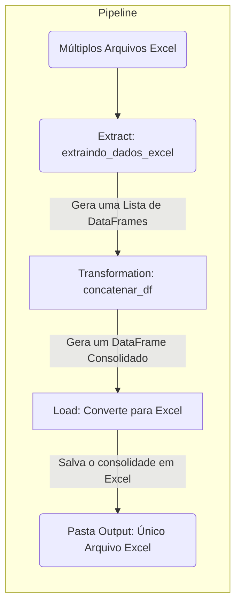

# Home

## Projeto de ETL

Seguindo Workshop 01 - 2023 do [Luciano Vasconcelos Galvão](https://www.linkedin.com/in/lucianovasconcelosf/)

## Objetivo do Projeto

Realizar uma ETL onde recebe diversos arquivos em formato excel e concatenam ele em um único arquivo, utilizando melhores práticas de padrões de código, com black e isort, como também melhores práticas de pre-commit, documentação, teste e CI.
Projeto bem completo para aplicações em diversas outras situações.

## Fluxo do Projeto

## Stack Utilizada

- Python
- Pyenv
- Poetry
- Pandas
- Pytest
- Black
- Isort
- Pre-Commit
- MkDocs
- Pip-Audit
- Pydocstyle
- Taskipy

## Configuração do Computador Utilizado

- Processador: AMD Ryzen 3 5300U with Radeon Graphics 2.6 Ghz
- RAM: 8 GB DDR-4
- SSD Sata: 256 GB
- SO: Windows 11 23H2