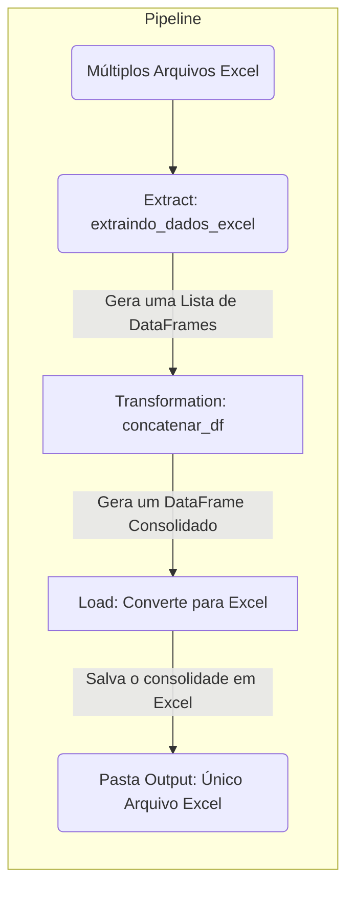

# Home

Bem vindo a página do Projeto de ETL, o projeto tem como objetivo juntar varios arquivos em um úncio arquivo e realziar transformações no meio do caminho.

## Fluxo do Projeto

```mermaid
flowchart LR
    subgraph ETL [Pipeline]
        A(Múltiplos Arquivos Excel) --> B[Extract: extraindo_dados_excel]
        B(Extract: extraindo_dados_excel) --> |Gera uma Lista de DataFrames| C[Transformation: concatenar_df]
        C --> |Gera um DataFrame Consolidado| D[Load: Converte para Excel]
        D --> |Salva o consolidade em Excel| E(Pasta Output: Único Arquivo Excel)
    end
```
